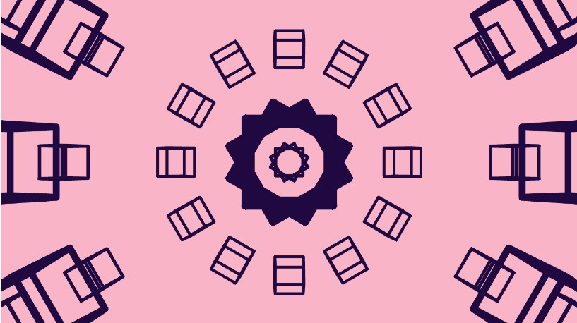
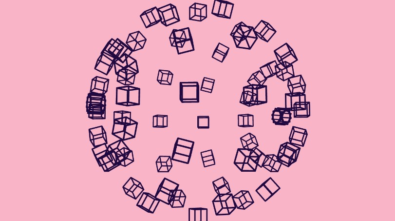
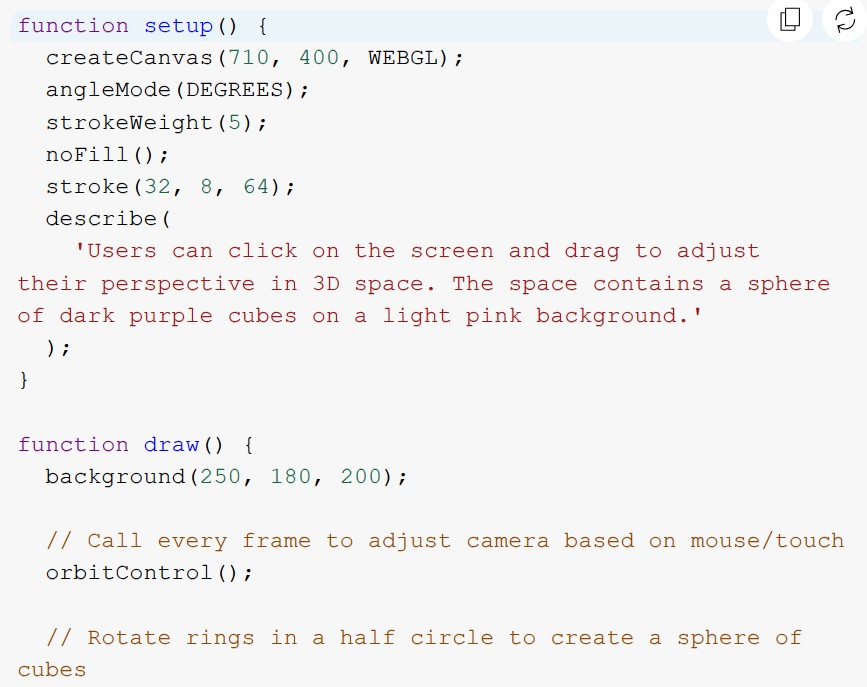
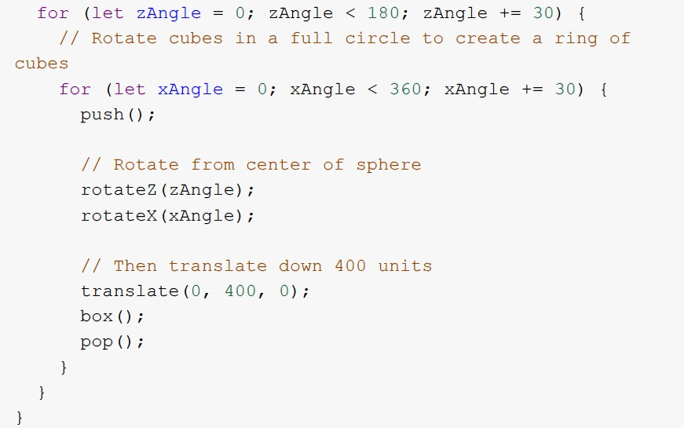

# jiyu0941_9103_tut04

## Quiz 8 Inspiration research
### Jia Yu 540898455

#### The reason for choosing it
The precedent of inspiration I was looking for was called **Orbit Control**. Since all the previous quizzes I did were presented in **two dimensions** and **lacked user interaction**, I chose this example because it presents ordinary sketches in **three dimensions** and users can increase their **sense of participation** by operating the mouse scroll wheel to zoom in or out or dragging the mouse to preview in a way similar to holographic projection.

##### zoom in

##### zoom out

#### Coding technique analysis

The key coding technique to achieve this visual effect is **3D transformation and rotation in the WebGL rendering context**, using the **rotateZ**, **rotateX**, and **translate** functions to position and rotate the cube in 3D space.
1. Set the canvas to 3D rendering mode using the WebGL library to create the cube.
2. The outer loop (zAngle) rotates the cube along the Z axis, and the inner loop (xAngle) rotates the cube along the X axis, forming circles of cubes.
3. The rotateZ and rotateX functions are used to rotate around the Z and X axes respectively. In this code, the loop gradually rotates the coordinate system, creating the effect of multiple cubes arranged in a sphere.
4. orbitControl() allows the user to adjust the viewing angle of the 3D scene by dragging the mouse or scrolling the scroll wheel.
5.After rotating the scene, translate(0, 400, 0) moves the cube's position 400 units downward along the Y axis.

##### Screenshot of technique used

[Link for project Orbit Control](https://p5js.org/examples/3d-orbit-control/
)

